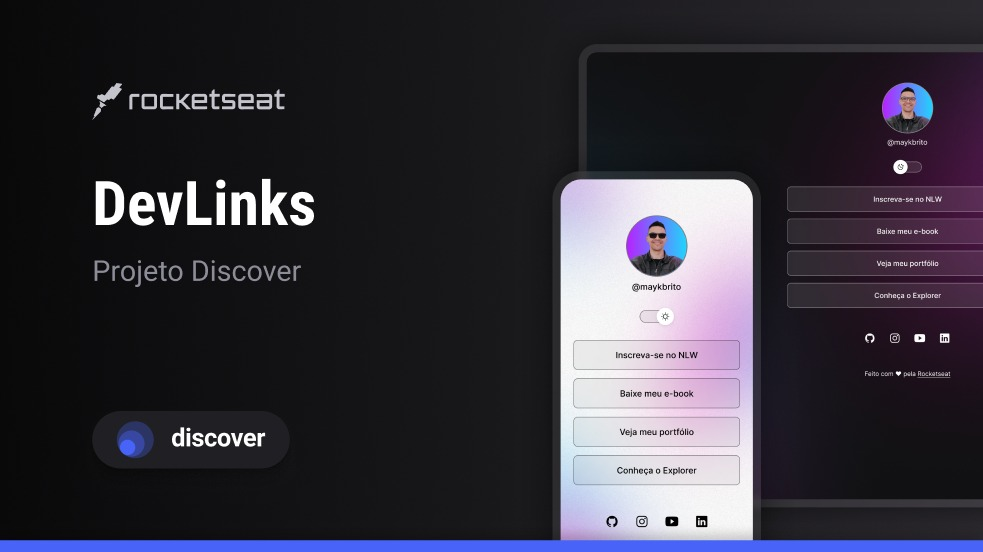

# DevLinks

> Learning track

Project developed during the Discover course by Rocketseat.

[🔗 Click here to see](https://app.rocketseat.com.br/jornada/discover/conteudos)

## 🛠 Technologies

- HTML
- CSS
- Git and Github
- Figma

<h1>📝What I Learned</h1>

<h2>CSS:</h2>
Elements Alignment  
Containers customization  
Pseudo-classes

<h2>HTML:</h2>

List  
Font  
Container hierarchy

<h2>JAVASCRIPT:</h2>

Functions  
Const  
Variables
